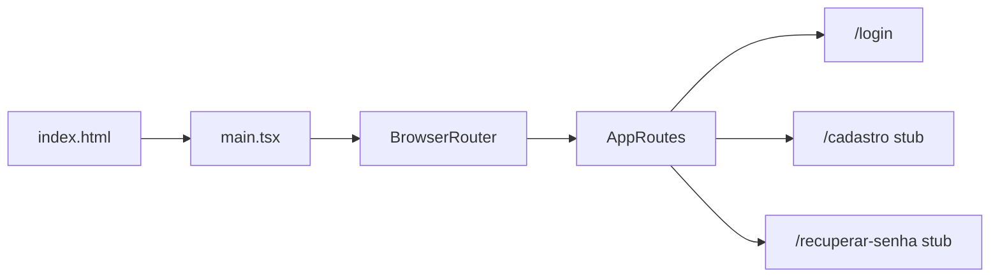

# Estado atual do bot-rafael-app

Documentação do projeto na versão **0.0.0**. Última revisão: tela de login, design system Proton Enterprise, React Router e Zod.

## Resumo

| Aspecto | Situação atual |
|---------|----------------|
| **Propósito** | Frontend SPA para interface do bot Rafael; login implementado, sem API de auth |
| **Stack** | React 19, TypeScript 5.8, Vite 6, Tailwind CSS 4, ESLint 9 |
| **Linguagem** | TypeScript (`.ts` / `.tsx`), modo `strict` |
| **Roteamento** | `react-router-dom`: `/` → `/login`; stubs `/cadastro`, `/recuperar-senha` |
| **Validação** | Zod (`loginSchema`) nos formulários de login |
| **Design** | Tokens em `src/index.css` (@theme) conforme [DESIGN.md](../DESIGN.md) |
| **Estado global** | Não há (formulários com estado local) |
| **API / backend** | Não integrado (submit mock na login) |
| **Testes** | Não configurados |
| **CI/CD** | Não configurado |
| **Variáveis de ambiente** | Não utilizadas (sem `.env`) |

## Stack e versões instaladas

| Pacote | Papel |
|--------|--------|
| `react` / `react-dom` | UI |
| `react-router-dom` | Rotas SPA |
| `zod` | Schemas e validação de formulários |
| `typescript` | Verificação de tipos (`tsc -b`) |
| `vite` | Dev server e build |
| `@vitejs/plugin-react` | Fast Refresh e TSX |
| `tailwindcss` + `@tailwindcss/vite` | Estilos (tokens via `@theme`) |
| `typescript-eslint` | Lint TypeScript |

**Pré-requisito:** Node.js 20.19+ ou 22.12+.

## Estrutura de diretórios

```
bot-rafael-app/
├── DESIGN.md
├── docs/
│   └── ESTADO-ATUAL.md
├── src/
│   ├── components/ui/       # Icon, Button, TextField
│   ├── layouts/
│   │   └── AuthShell.tsx
│   ├── pages/
│   │   ├── login/
│   │   │   ├── index.tsx
│   │   │   ├── components/
│   │   │   └── schemas/loginSchema.ts
│   │   ├── cadastro/
│   │   └── recuperar-senha/
│   ├── routes/
│   │   └── AppRoutes.tsx
│   ├── App.tsx
│   ├── main.tsx
│   └── index.css            # @theme + fontes Inter/Material Symbols
├── index.html
└── ...
```

## Fluxo da aplicação



1. `index.html` carrega `/src/main.tsx`.
2. `main.tsx` importa CSS, `BrowserRouter` e `App`.
3. `AppRoutes` redireciona `/` para `/login`.
4. Login valida com Zod; em sucesso exibe mensagem mock após ~1s.

## Comportamento da UI atual

### `/login`

- Card central (Proton Enterprise): logo, e-mail, senha, toggle visibilidade.
- Erros de campo em português via Zod; `noValidate` no form.
- Links para `/recuperar-senha` e `/cadastro`.
- Submit mock: loading no botão, mensagem "Iniciando sessão...".

### `/cadastro` e `/recuperar-senha`

- Mesmo shell (`AuthShell` + card); texto "Em construção" e link voltar ao login.

## Design system

- Cores e tipografia definidos em `@theme` em `src/index.css` (fonte **Inter**, ícones **Material Symbols**).
- Fundo de página `#F8FAFC`; card com `.card` (`Card`) e animações CSS `fade-up`.

## O que ainda não existe

- Guard de sessão / redirect pós-login para home autenticada
- Integração HTTP (`VITE_API_URL`)
- Testes (Vitest)
- Formulários reais em cadastro e recuperar senha
- Lógica de bot ou APIs externas

## Próximos passos sugeridos

1. Auth real (API + persistência de sessão + rota home).
2. Formulários de cadastro/recuperação com Zod.
3. Vitest + React Testing Library.
4. Variáveis de ambiente (`VITE_*`).

## Referências

- [README.md](../README.md)
- [AGENTS.md](../AGENTS.md)
- [DESIGN.md](../DESIGN.md)
