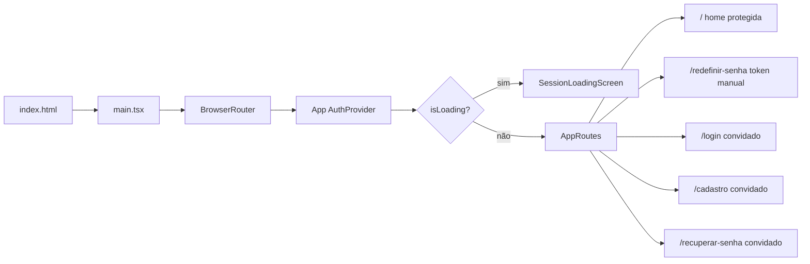

# Estado atual do bot-rafael-app

Documentação do projeto na versão **0.0.0**. Última revisão: auth Supabase, login, cadastro e recuperação de senha integrados.

## Resumo

| Aspecto | Situação atual |
|---------|----------------|
| **Propósito** | Frontend SPA para interface do bot Rafael; auth com Supabase e cadastro de proposta imobiliária |
| **Stack** | React 19, TypeScript 5.8, Vite 6, Tailwind CSS 4, ESLint 9 |
| **Linguagem** | TypeScript (`.ts` / `.tsx`), modo `strict` |
| **Roteamento** | `react-router-dom`: `/` protegida; `/redefinir-senha` pública (valida token manualmente); `/login`, `/cadastro`, `/recuperar-senha` para convidados |
| **Auth** | Supabase (`signInWithPassword`, `signUp`, `resetPasswordForEmail`, `updateUser`, sessão em localStorage, `AuthProvider`) |
| **Validação** | Zod (`loginSchema`, `signupSchema`, `forgotPasswordSchema`, `resetPasswordSchema`) nos formulários de auth |
| **Design** | Tokens em `src/index.css` (@theme) conforme [DESIGN.md](../DESIGN.md) |
| **Estado global** | `AuthProvider` + `useAuth` (sessão Supabase) |
| **API / backend** | Supabase Auth (e-mail/senha); API pública do IBGE para municípios do Ceará; recuperação ainda stub |
| **Testes** | Não configurados |
| **CI/CD** | Não configurado |
| **Variáveis de ambiente** | `VITE_SUPABASE_URL`, `VITE_SUPABASE_ANON_KEY` (ver `.env.example`) |

## Stack e versões instaladas

| Pacote | Papel |
|--------|--------|
| `react` / `react-dom` | UI |
| `react-router-dom` | Rotas SPA + guards |
| `@supabase/supabase-js` | Cliente Supabase Auth |
| `sonner` | Toasts (erros de auth) |
| `zod` | Schemas e validação de formulários |
| `typescript` | Verificação de tipos (`tsc -b`) |
| `vite` | Dev server e build |
| `@vitejs/plugin-react` | Fast Refresh e TSX |
| `tailwindcss` + `@tailwindcss/vite` | Estilos (tokens via `@theme`) |
| `typescript-eslint` | Lint TypeScript |

**Pré-requisito:** Node.js 20.19+ ou 22.12+.

## Estrutura de diretórios

```
bot-rafael-app/
├── .env.example
├── DESIGN.md
├── docs/
│   └── ESTADO-ATUAL.md
├── src/
│   ├── components/
│   │   ├── auth/            # ProtectedRoute, GuestRoute
│   │   └── ui/              # AuthHeader, Button, Checkbox, TextField, Card, ...
│   ├── contexts/
│   │   ├── AuthProvider.tsx
│   │   └── auth-context.ts
│   ├── hooks/
│   │   └── usePasswordRecoveryAccess.ts
│   ├── lib/
│   │   └── supabase.ts
│   ├── layouts/
│   │   └── AuthShell.tsx
│   ├── pages/
│   │   ├── home/            # Rota protegida: Nova Proposta
│   │   ├── login/
│   │   ├── cadastro/        # signUp integrado
│   │   ├── recuperar-senha/ # resetPasswordForEmail
│   │   └── redefinir-senha/ # updateUser após link do e-mail
│   ├── routes/
│   │   └── AppRoutes.tsx
│   ├── App.tsx
│   ├── main.tsx
│   └── index.css
├── index.html
└── ...
```

## Fluxo da aplicação



1. `index.html` carrega `/src/main.tsx`.
2. `AuthProvider` resolve sessão via `getSession` + `onAuthStateChange`.
3. Enquanto carrega, exibe spinner fullscreen.
4. Rotas protegidas (`/`) redirecionam para `/login` sem sessão.
5. Rotas de convidado (`/login`, etc.) redirecionam para `/` se já logado.
6. `/redefinir-senha` valida token manualmente; sem token válido não cria sessão.
7. Login chama `signInWithPassword`; erro → toast genérico em PT; sucesso → `/`.
8. Cadastro chama `signUp` com `user_metadata.full_name`; sessão → `/`; sem sessão → tela de confirmação de e-mail.
9. Recuperação: `resetPasswordForEmail` → e-mail com link Supabase → `/redefinir-senha` (validação manual do token) → `updateUser` → `signOut` → `/login` com toast de sucesso.

## Comportamento da UI atual

### `/` (protegida)

- Tela "Nova Proposta" exibida após login.
- Layout com sidebar fixa em desktop, topo com usuário e ação de sair (`signOut`).
- Formulário de dados do cliente: nome, CPF obrigatório, telefone obrigatório e e-mail obrigatório com validação de formato.
- Formulário de dados do imóvel: tipo (`Novo`/`Usado`) e município obrigatório com busca carregada pela API pública do IBGE.
- Área de documentos adicionais com upload múltiplo, lista de arquivos selecionados e remoção individual antes do envio.
- Campo aberto de informações adicionais com limite de 10.000 caracteres.
- Resumo da proposta atualizado em tela e validação básica antes de enviar.
- Envio ainda não integra backend/storage; por enquanto exibe feedback via toast.

### `/login`

- Card central (Proton Enterprise): logo, e-mail, senha, toggle visibilidade.
- Erros de campo em português via Zod (senha mín. 6 caracteres).
- Erro de credenciais: toast "E-mail ou senha incorretos" (sonner).
- E-mail não confirmado: toast "Confirme seu e-mail antes de entrar. Verifique sua caixa de entrada."
- Links para `/recuperar-senha` e `/cadastro`.
- Após redefinir senha: toast "Senha redefinida com sucesso. Faça login com sua nova senha." (via `location.state`).

### `/cadastro`

- Formulário: nome completo, e-mail, senha, confirmar senha, checkbox de termos.
- Validação Zod em português; nome salvo em `user_metadata.full_name`.
- Erro de API: toast genérico "Não foi possível criar a conta. Tente novamente."
- Pós-cadastro: se Supabase retornar sessão → `/`; senão → tela inline "Confirme seu e-mail".
- Link para `/login` ("Já tem uma conta? Entrar").

### `/recuperar-senha`

- Formulário com e-mail; chama `resetPasswordForEmail` com `redirectTo: {origin}/redefinir-senha`.
- Sucesso → tela inline "Verifique seu e-mail" (padrão do cadastro).
- Erro de API → toast genérico "Não foi possível enviar. Tente novamente."
- Redireciona para `/` se o usuário já estiver autenticado (`GuestRoute`).

### `/redefinir-senha` (pública, validação manual)

- Rota fora de `ProtectedRoute`/`GuestRoute`; sessão **não** é criada automaticamente pela URL (`detectSessionInUrl: false`).
- Hook valida token da URL (`setSession` no hash ou `verifyOtp` na query); link inválido/expirado → `signOut` + redirect `/recuperar-senha`.
- Link válido → sessão temporária de recovery (necessária para `updateUser`) + formulário nova senha + confirmar (Zod).
- Sucesso → `signOut` → `/login` com toast. Refresh durante o fluxo via flag em `sessionStorage`.

## Configuração Supabase (recuperação de senha)

No Dashboard → **Authentication**:

| Campo | Valor dev |
|-------|-----------|
| **Site URL** | `http://localhost:5173` |
| **Redirect URLs** | `http://localhost:5173/redefinir-senha` |

**Email Templates → Reset password:** o link deve usar `href="{{ .ConfirmationURL }}"` (fluxo implicit para SPA). Alternativa: `href="{{ .RedirectTo }}?token_hash={{ .TokenHash }}&type=recovery"` (exige `verifyOtp` no hook — já implementado).

Referências: [Password-based Auth](https://supabase.com/docs/guides/auth/passwords#resetting-a-password), [Email Templates](https://supabase.com/docs/guides/auth/auth-email-templates).

## Variáveis de ambiente

Copie `.env.example` para `.env` e preencha:

```
VITE_SUPABASE_URL=https://seu-projeto.supabase.co
VITE_SUPABASE_ANON_KEY=sua-anon-key
```

No Supabase Dashboard: **Authentication → Providers → Email** habilitado.

## O que ainda não existe

- Rota dedicada de confirmação de e-mail
- Links reais para Termos de Uso / Política de Privacidade
- Persistência/envio real dos documentos da proposta
- Testes (Vitest)
- Lógica de bot ou APIs além de Auth

## Próximos passos sugeridos

1. Home autenticada com funcionalidades do bot.
2. Vitest + React Testing Library.

## Referências

- [README.md](../README.md)
- [AGENTS.md](../AGENTS.md)
- [DESIGN.md](../DESIGN.md)
