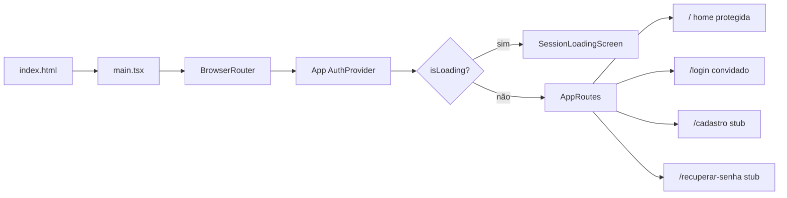

# Estado atual do bot-rafael-app

Documentação do projeto na versão **0.0.0**. Última revisão: auth Supabase, rota protegida `/`, login com sonner.

## Resumo

| Aspecto | Situação atual |
|---------|----------------|
| **Propósito** | Frontend SPA para interface do bot Rafael; login com Supabase Auth |
| **Stack** | React 19, TypeScript 5.8, Vite 6, Tailwind CSS 4, ESLint 9 |
| **Linguagem** | TypeScript (`.ts` / `.tsx`), modo `strict` |
| **Roteamento** | `react-router-dom`: `/` protegida (home); `/login`, `/cadastro`, `/recuperar-senha` para convidados |
| **Auth** | Supabase (`signInWithPassword`, sessão em localStorage, `AuthProvider`) |
| **Validação** | Zod (`loginSchema`) nos formulários de login |
| **Design** | Tokens em `src/index.css` (@theme) conforme [DESIGN.md](../DESIGN.md) |
| **Estado global** | `AuthProvider` + `useAuth` (sessão Supabase) |
| **API / backend** | Supabase Auth (e-mail/senha); cadastro/recuperação ainda stub |
| **Testes** | Não configurados |
| **CI/CD** | Não configurado |
| **Variáveis de ambiente** | `VITE_SUPABASE_URL`, `VITE_SUPABASE_ANON_KEY` (ver `.env.example`) |

## Stack e versões instaladas

| Pacote | Papel |
|--------|--------|
| `react` / `react-dom` | UI |
| `react-router-dom` | Rotas SPA + guards |
| `@supabase/supabase-js` | Cliente Supabase Auth |
| `sonner` | Toasts (erros de login) |
| `zod` | Schemas e validação de formulários |
| `typescript` | Verificação de tipos (`tsc -b`) |
| `vite` | Dev server e build |
| `@vitejs/plugin-react` | Fast Refresh e TSX |
| `tailwindcss` + `@tailwindcss/vite` | Estilos (tokens via `@theme`) |
| `typescript-eslint` | Lint TypeScript |

**Pré-requisito:** Node.js 20.19+ ou 22.12+.

## Estrutura de diretórios

```
bot-rafael-app/
├── .env.example
├── DESIGN.md
├── docs/
│   └── ESTADO-ATUAL.md
├── src/
│   ├── components/
│   │   ├── auth/            # ProtectedRoute, GuestRoute
│   │   └── ui/              # Icon, Button, TextField, Card, SessionLoadingScreen
│   ├── contexts/
│   │   ├── AuthProvider.tsx
│   │   └── auth-context.ts
│   ├── lib/
│   │   └── supabase.ts
│   ├── layouts/
│   │   └── AuthShell.tsx
│   ├── pages/
│   │   ├── home/            # Rota protegida (placeholder)
│   │   ├── login/
│   │   ├── cadastro/
│   │   └── recuperar-senha/
│   ├── routes/
│   │   └── AppRoutes.tsx
│   ├── App.tsx
│   ├── main.tsx
│   └── index.css
├── index.html
└── ...
```

## Fluxo da aplicação



1. `index.html` carrega `/src/main.tsx`.
2. `AuthProvider` resolve sessão via `getSession` + `onAuthStateChange`.
3. Enquanto carrega, exibe spinner fullscreen.
4. Rotas protegidas (`/`) redirecionam para `/login` sem sessão.
5. Rotas de convidado (`/login`, etc.) redirecionam para `/` se já logado.
6. Login chama `signInWithPassword`; erro → toast genérico em PT; sucesso → `/`.

## Comportamento da UI atual

### `/` (protegida)

- Placeholder: boas-vindas, e-mail do usuário, botão Sair (`signOut`).

### `/login`

- Card central (Proton Enterprise): logo, e-mail, senha, toggle visibilidade.
- Erros de campo em português via Zod (senha mín. 6 caracteres).
- Erro de credenciais: toast "E-mail ou senha incorretos" (sonner).
- Links para `/recuperar-senha` e `/cadastro`.

### `/cadastro` e `/recuperar-senha`

- Mesmo shell (`AuthShell` + card); texto "Em construção" e link voltar ao login.
- Redirecionam para `/` se o usuário já estiver autenticado.

## Variáveis de ambiente

Copie `.env.example` para `.env` e preencha:

```
VITE_SUPABASE_URL=https://seu-projeto.supabase.co
VITE_SUPABASE_ANON_KEY=sua-anon-key
```

No Supabase Dashboard: **Authentication → Providers → Email** habilitado.

## O que ainda não existe

- Cadastro e recuperar senha integrados ao Supabase
- Confirmação de e-mail (fluxo dedicado)
- Testes (Vitest)
- Lógica de bot ou APIs além de Auth

## Próximos passos sugeridos

1. Formulários de cadastro/recuperação com Supabase Auth.
2. Home autenticada com funcionalidades do bot.
3. Vitest + React Testing Library.

## Referências

- [README.md](../README.md)
- [AGENTS.md](../AGENTS.md)
- [DESIGN.md](../DESIGN.md)
