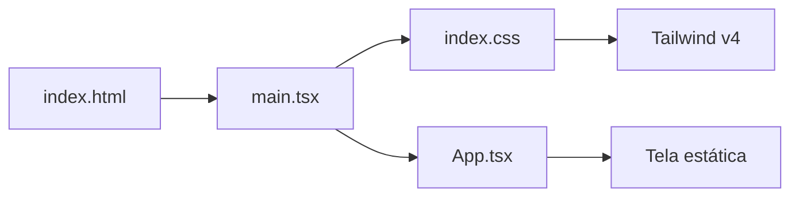

# Estado atual do bot-rafael-app

Documentação do projeto na versão **0.0.0** (scaffold inicial). Última revisão: stack React + Vite + Tailwind CSS v4 + **TypeScript**.

## Resumo

| Aspecto | Situação atual |
|---------|----------------|
| **Propósito** | Frontend SPA em estágio inicial; nome sugere app relacionado a um bot (Rafael), sem integração de bot ainda |
| **Stack** | React 19, TypeScript 5.8, Vite 6, Tailwind CSS 4, ESLint 9 |
| **Linguagem** | TypeScript (`.ts` / `.tsx`), modo `strict` |
| **Roteamento** | Não configurado (página única) |
| **Estado global** | Não há (sem Redux, Zustand, etc.) |
| **API / backend** | Não integrado |
| **Testes** | Não configurados |
| **CI/CD** | Não configurado |
| **Variáveis de ambiente** | Não utilizadas (sem `.env`) |

## Stack e versões instaladas

Dependências resolvidas via `npm install` (ver `package-lock.json`):

| Pacote | Papel |
|--------|--------|
| `react` / `react-dom` | UI |
| `typescript` | Verificação de tipos (`tsc -b`) |
| `vite` | Dev server e build |
| `@vitejs/plugin-react` | Fast Refresh e TSX |
| `tailwindcss` + `@tailwindcss/vite` | Estilos (sem PostCSS manual) |
| `typescript-eslint` | Lint TypeScript |
| `@types/react` / `@types/react-dom` | Tipos React |

**Pré-requisito:** Node.js 20.19+ ou 22.12+.

## Estrutura de diretórios

```
bot-rafael-app/
├── docs/
│   └── ESTADO-ATUAL.md
├── public/
│   └── vite.svg
├── src/
│   ├── main.tsx             # bootstrap React
│   ├── App.tsx              # componente raiz
│   ├── vite-env.d.ts        # referência vite/client
│   └── index.css            # Tailwind
├── AGENTS.md
├── README.md
├── eslint.config.js
├── index.html
├── package.json
├── tsconfig.json            # project references
├── tsconfig.app.json        # src/
├── tsconfig.node.json       # vite.config.ts
├── vite.config.ts
└── .gitignore
```

Artefatos locais não versionados: `node_modules/`, `dist/`, `node_modules/.tmp/` (cache do `tsc`).

## Fluxo da aplicação



1. `index.html` carrega `/src/main.tsx`.
2. `main.tsx` importa CSS, monta `App` em `StrictMode` via `createRoot`.
3. `index.css` usa `@import "tailwindcss";`.
4. `App.tsx` renderiza landing minimalista.

## Comportamento da UI atual

A tela única (`App.tsx`) exibe:

- Layout centralizado, tema escuro (slate).
- Título **bot-rafael-app** e subtítulo **React + Vite + Tailwind CSS + TypeScript**.
- Link para documentação do Vite.

## Configuração TypeScript

| Arquivo | Escopo |
|---------|--------|
| `tsconfig.app.json` | `src/` — JSX `react-jsx`, `strict`, sem emit |
| `tsconfig.node.json` | `vite.config.ts` |
| `tsconfig.json` | Referências aos dois projetos acima |

Scripts:

- `npm run typecheck` — `tsc -b --noEmit`
- `npm run build` — `tsc -b && vite build` (tipos antes do bundle)

## Configuração de build e estilo

### Vite (`vite.config.ts`)

Plugins: `react()`, `tailwindcss()`. Porta padrão **5173**.

### Tailwind CSS v4

Sem `tailwind.config.js` / `postcss.config.js`. Tokens customizados via `@theme` em `index.css`.

### ESLint

Flat config com `typescript-eslint`; arquivos `**/*.{ts,tsx}`.

### Scripts npm

| Script | Efeito |
|--------|--------|
| `dev` | Servidor com HMR |
| `build` | Typecheck + build → `dist/` |
| `typecheck` | Apenas verificação de tipos |
| `preview` | Serve `dist/` |
| `lint` | ESLint |

## O que ainda não existe

- React Router ou roteador
- Testes (Vitest, Testing Library, etc.)
- Prettier
- Autenticação, HTTP client, WebSocket
- Docker, CI/CD, deploy
- PWA, i18n, design system
- Lógica de bot ou APIs externas

## Próximos passos sugeridos

1. Rotas e layout (`react-router-dom`).
2. Componentes em `src/components/`.
3. Variáveis de ambiente (`VITE_*`, tipos em `vite-env.d.ts`).
4. Vitest + React Testing Library.
5. Integração com API do bot.
6. Atualizar esta documentação e `AGENTS.md` conforme evoluir.

## Referências

- [README.md](../README.md)
- [AGENTS.md](../AGENTS.md)
